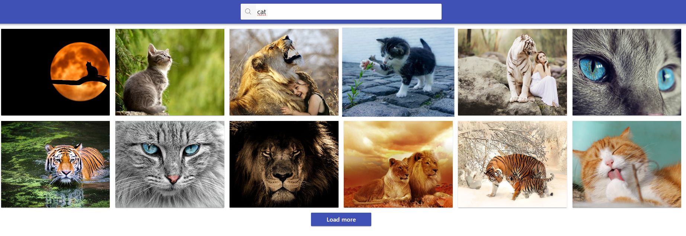
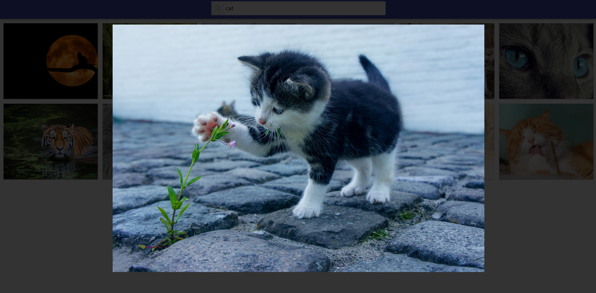

# ImageSearch app

This is a React app built using
[Create React App](https://github.com/facebook/create-react-app) as a part of
GoIT course. It's an image search engine powered by
[Pixabay API](https://pixabay.com/api/docs/).

## Features

This app allows you to search for images on [Pixabay](https://pixabay.com/)
using keywords. Each search yields 12 results per page with an option to
manually load the next one.



Clicking on each image will bring up a modal window with it's full resolution
version. You can exit out of it by clicking again anywhere on the page or
pressing the ESC key.



## Setup

1. Clone this repository.
2. Install the project's base dependencies using command

```shell
npm install
```

3. Start development mode by running command

```shell
npm start
```

4. You will now be able to access the app by going to
   [http://localhost:3000](http://localhost:3000) in your browser.
